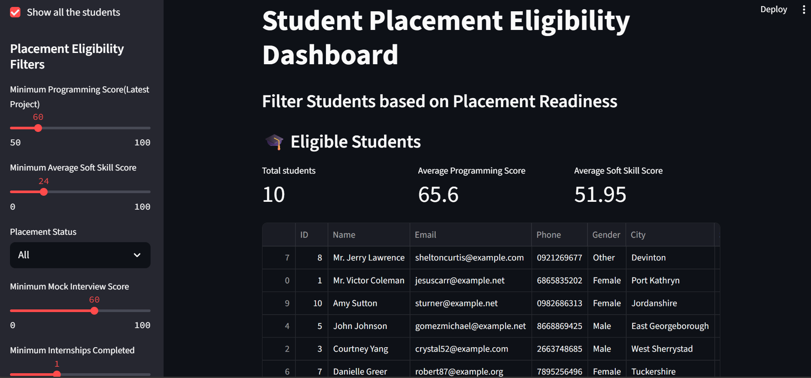

# 🎓 Placement Eligibility Streamlit Dashboard
This is a complete dashboard built with **Streamlit**, **MySQL**, and **Python** to evaluate student placement eligibility based on various filters like:
-Programming Scores
-Mock Interview Scores
-Soft Skills
-Intership Experience
-Placement Status

It also includes SQL-powered insights with charts and a user friendly interface


##FOLDER STRUCTURE

placement_app_project

app
- app.py
database
- db_manager.py
- step01_generate_students_data.ipynb
sql_insights
- queries.sql
README.md


## FEATURES

-  Apply filters based on Programming Score, Soft Skills, Mock Interview Score, Internships Completed, and Placement Status.
-  View interactive dashboards with student details and summary metrics.
-  Explore insightful SQL-based visualizations like:
  - Average programming score per course batch
  - Top 5 students ready for placement
  - Soft skills distribution
  - Most common programming languages
  - Internship and placement trends
-  Organized project with separate folders for app, database, and SQL insights.

 ## Technologies used

-  Python
-  MySQL (Relational Database)
-  Streamlit (Dashboard UI)
-  Faker (Synthetic Data Generation)
-  Pandas (Data Manipulation)
-  Git & GitHub (Version Control & Collaboration)

  ## How to Run the App

1. **Clone the Repository**
   - Open your terminal and run:
     ```
     git clone https://github.com/Shwetanshi28/placement_app_project.git
     ```

2. **Navigate into the Project Folder**

3. **Install Required Libraries**
- Make sure you have Python installed.
- Install dependencies:
  ```
  pip install -r requirements.txt
  ```
*(If you don’t have a `requirements.txt`, you can install manually: `pip install streamlit mysql-connector-python pandas faker`)*

4. **Set up MySQL Database**
- Start your MySQL server.
- Open the Jupyter Notebook:
  ```
  database/step01_generate_students_data.ipynb
  ```
- Run the cells to create tables and insert fake student data.

5. **Launch the Streamlit App**

6. **Use the Filters**
- Interact with the filters on the left sidebar to explore eligible students.
- Scroll to the bottom for insights and visual analytics.

## Dashboard Screenshot
[](placement_dashboard.png)
